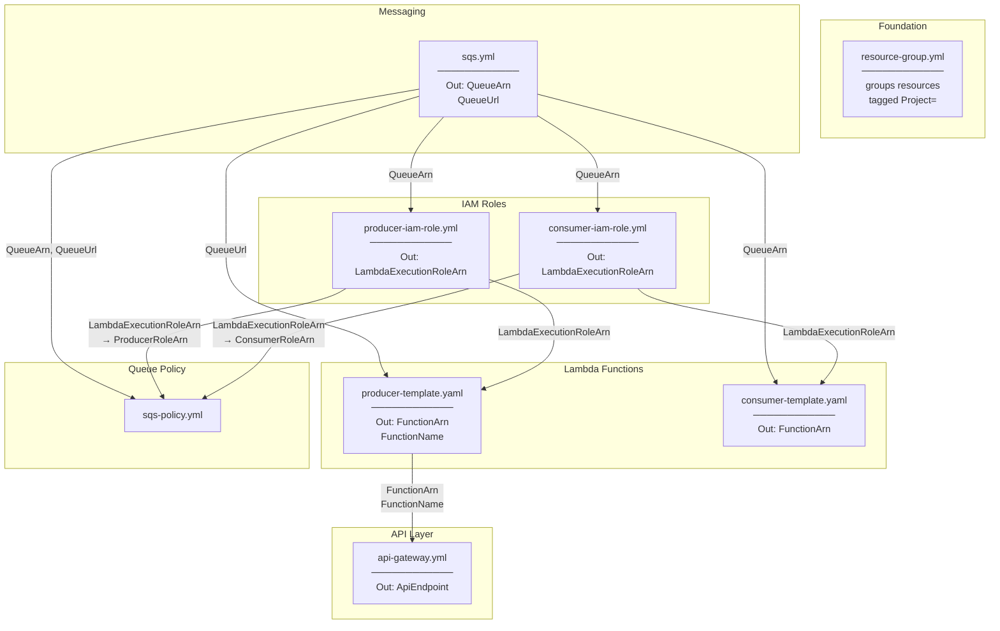

# stockholm-api-gateway-http-api

## CloudFormation Stack Diagram

```mermaid
flowchart TD
    subgraph app_stack["Foundation"]
        APP["resource-group.yml\n────────────\ngroups resources\ntagged Project=<project>"]
    end

    subgraph sqs_stack["Messaging"]
        SQS["sqs.yml\n────────────\nOut: QueueArn\n     QueueUrl"]
    end

    subgraph iam_stack["IAM Roles"]
        PROD_ROLE["producer-iam-role.yml\n────────────\nOut: LambdaExecutionRoleArn"]
        CONS_ROLE["consumer-iam-role.yml\n────────────\nOut: LambdaExecutionRoleArn"]
    end

    subgraph lambda_stack["Lambda Functions"]
        PRODUCER["producer-template.yaml\n────────────\nOut: FunctionArn\n     FunctionName"]
        CONSUMER["consumer-template.yaml\n────────────\nOut: FunctionArn"]
    end

    subgraph policy_stack["Queue Policy"]
        SQS_POL["sqs-policy.yml"]
    end

    subgraph api_stack["API Layer"]
        APIGW["api-gateway.yml\n────────────\nOut: ApiEndpoint"]
    end

    SQS -->|"QueueArn"| PROD_ROLE
    SQS -->|"QueueArn"| CONS_ROLE
    SQS -->|"QueueArn, QueueUrl"| SQS_POL
    SQS -->|"QueueUrl"| PRODUCER
    SQS -->|"QueueArn"| CONSUMER

    PROD_ROLE -->|"LambdaExecutionRoleArn\n→ ProducerRoleArn"| SQS_POL
    PROD_ROLE -->|"LambdaExecutionRoleArn"| PRODUCER

    CONS_ROLE -->|"LambdaExecutionRoleArn\n→ ConsumerRoleArn"| SQS_POL
    CONS_ROLE -->|"LambdaExecutionRoleArn"| CONSUMER

    PRODUCER -->|"FunctionArn\nFunctionName"| APIGW
```
